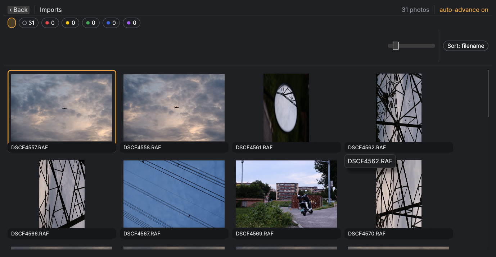
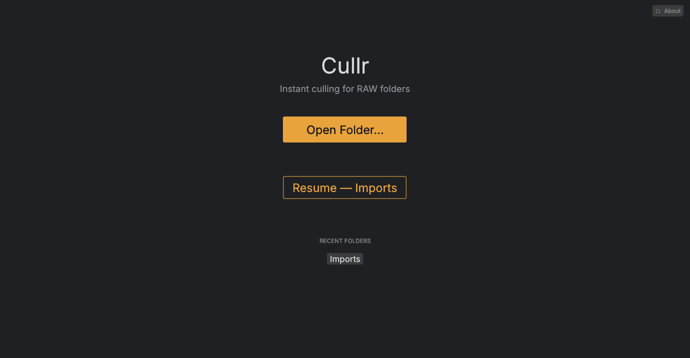

# Cullr

Photo Mechanic-style culling for RAW photographs. Open a folder, browse embedded JPEG previews instantly, mark colors, filter. Keyboard-first.



*Contact sheet — filter chips with live counts, zoom slider, filename sort, color labels.*



*Home — open a folder or resume where you left off.*

## Why

Culling speed comes from embedded JPEG previews, never full RAW decode. The contact sheet is virtualized — only visible cells hold GPU textures — and every extracted preview and thumbnail is cached on disk keyed by path + mtime, so re-opening a known folder is instant.

## Features

- Virtualized contact sheet: only visible cells own GPU textures (LRU cache, 512 MB budget)
- Full-screen loupe: fit / 100% zoom toward cursor, drag to pan, neighbor prefetch
- Photoshop-style zoom: `Ctrl+0` fit / `Ctrl+1` 100%, `Ctrl+=` / `Ctrl+-` steps, double-click flips under the cursor, Shift-drag marquee zoom, zoom % pill with scrubby drag
- Lightbox (`L`): chromeless photo on black (or pure white with `W`) for an unobstructed look — from the grid or the loupe
- Portrait auto-detect: EXIF orientation applied on display; `[` / `]` rotate manually (persisted)
- Color labels `1`–`5` / `0` (red, yellow, green, blue, purple / clear), persisted instantly
- Auto-advance after labeling (`Tab` toggle, persisted)
- Filter chips with live per-label counts; `F` cycles All → Labeled → Unlabeled presets
- Selection: click, Ctrl-click, Shift-click range, drag marquee; batch labeling with one keystroke
- Export: copy the originals of your selection (or filtered view) to any folder — bottom-right button or `Ctrl+E`, cross-platform native folder picker
- RAW+JPEG pairs: folders shot RAW+JPEG show one photo per pair (the RAW, tagged `RAW+JPEG`); exporting copies both files
- Cell-size zoom slider + Ctrl+wheel (128–1024 px)
- Sort by filename or taken_at
- `?` shortcut overlay
- Window size/position and last folder resume across restarts
- About dialog with license notices
- Error tiles degrade gracefully — a corrupt or unsupported file never blocks the pipeline
- Formats: RAW formats supported by [rawler](https://github.com/dnglab/dnglab) (CR2/CR3/NEF/ARW/DNG/RAF/ORF/RW2 and friends)

## Install & build

Prerequisites: Rust 1.85+.

```sh
curl --proto '=https' --tlsv1.2 -sSf https://sh.rustup.rs | sh
```

Build:

```sh
cargo build --release
```

The binary lands at `target/release/cullr-ui`. Run it with no arguments (Home view) or point it straight at a folder:

```sh
cullr-ui
cullr-ui /path/to/photos
```

Linux-first (X11 and Wayland verified), portable anywhere Rust builds. No system library requirements beyond GPU/OpenGL drivers — SQLite is bundled.

## Keyboard reference

| Key | Action |
|---|---|
| `←→↑↓` | move cursor |
| `1..5` / `0` | label red/yellow/green/blue/purple / clear |
| `[` / `]` | rotate 90° left / right (persisted) |
| `Tab` | toggle auto-advance-after-label (persisted) |
| `Enter` / `Esc` | loupe ⇄ grid |
| `Space` | loupe: fit/100% · grid: enter loupe |
| `Ctrl+0` / `Ctrl+1` | loupe: fit / 100% pixel parity |
| `Ctrl+=` / `Ctrl+-` | loupe: zoom in / out a step |
| `L` | lightbox on/off · grid: open straight into it |
| `W` | lightbox: white ↔ black backdrop |
| `Ctrl+A` / `Shift+A` | select all / none |
| `Ctrl+E` | export originals (selection, else filtered view) |
| `F` | cycle filter preset: All → Labeled → Unlabeled |
| `?` | shortcut overlay |

Mouse: click selects, Ctrl-click toggles, Shift-click extends a range, drag draws a marquee; Ctrl+wheel zooms cell size (grid) or zooms toward the cursor (loupe). In the loupe, double-click flips fit ↔ 100% under the cursor and Shift-drag marquee-zooms into a region.

## Performance

Acceptance budgets from `SPEC.md` §8, with measured results where available — measured on the developer's machine, release builds.

| Metric | Budget | Measured |
|---|---|---|
| Scan 10k files | < 300 ms | 101.8 ms |
| Warm rescan 10k | — | 60.2 ms |
| 50k soak (scan) | — | cold 539 ms / warm 275 ms |
| First thumb (cold) | < 1.5 s | met |
| Ingest throughput | ≥ 20 files/s (8-core NVMe, CR3) | met on reference media |
| Loupe open (warm) | < 30 ms | met |

## Third-party notices

**rawler** © dnglab contributors, licensed **LGPL-2.1-only**. Cullr is GPL-3.0-or-later; rawler is linked as a separate library and its source remains available at the [dnglab repository](https://github.com/dnglab/dnglab), satisfying LGPL §6's relink requirement. All rawler usage in Cullr is confined to one module (`crates/cullr-core/src/extract.rs`).

Other major dependencies (versions per `Cargo.lock`, licenses verified from the vendored sources):

| Crate | License |
|---|---|
| eframe 0.36, egui 0.36 | MIT OR Apache-2.0 |
| rusqlite 0.37 (MIT); libsqlite3-sys bundles SQLite (public domain) | MIT |
| image 0.25 | MIT OR Apache-2.0 |
| rayon 1.12 | MIT OR Apache-2.0 |
| walkdir 2.5 | Unlicense/MIT |
| crossbeam-channel 0.5 | MIT OR Apache-2.0 |
| rfd 0.15 | MIT |
| dirs 6.0 | MIT OR Apache-2.0 |
| md-5 0.10 | MIT OR Apache-2.0 |
| tracing 0.1 | MIT |

## License

Cullr is GPL-3.0-or-later — see [LICENSE](LICENSE).

## Development

```sh
cargo test --workspace
cargo clippy --workspace --all-targets -- -D warnings
cargo fmt --all
```

Performance gates:

```sh
CULLR_PERF=<scratch dir> cargo test --release -p cullr-core --test perf
```

Fixture-gated integration tests run only when `CULLR_FIXTURES` is set — see `crates/cullr-core/tests/fixtures.rs` for the expected layout. The architecture overview lives in [SPEC.md](SPEC.md).
